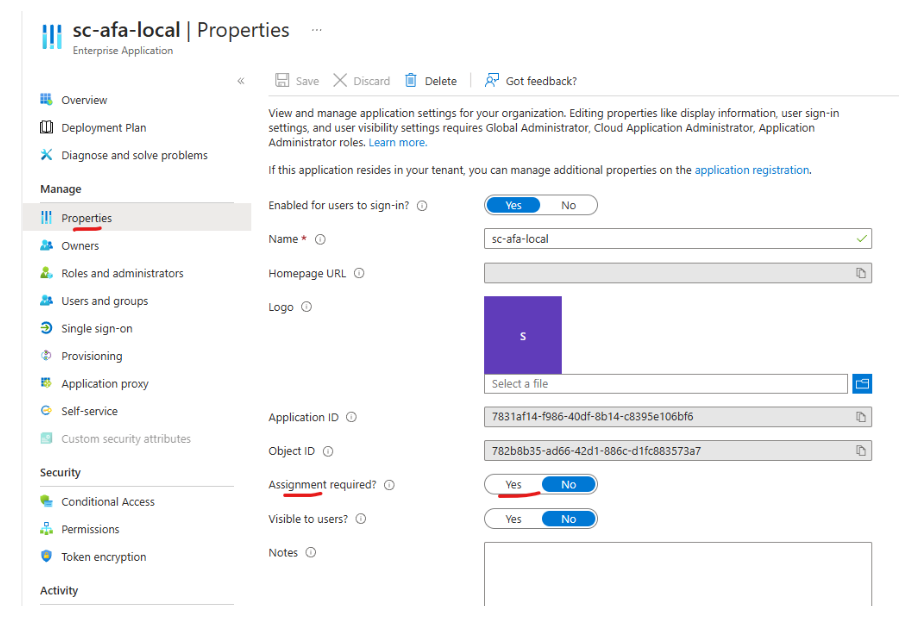

## Azure Entra ID integration with Sitecore - Bits and Bytes

There are plenty of articles you can find online that describe, step by step, how Azure AD (now Azure Entra ID) can be integrated to enable Sitecore CM login. For example, [this one by SitecoreDude](https://sitecoredude.com/how-to-integrate-azure-ad-with-sitecore-content-management-in-10-easy-steps/), [this one by Fishtank](https://www.getfishtank.com/insights/configuring-azure-ad-authentication-with-sitecore), or if you prefer a deeper look then [this one by Merkle](https://sitecore.merkle.com/sitecore-identity-server-in-a-nutshell/). There are also some great video walkhthroghs, such as [this by Techshare](https://youtu.be/0FfdO9-Q-Co?si=hnogEBORwKVikIuA), or for a more in-depth perspective you can check out [this one by Sitecore Usergroup Poland](https://youtu.be/Vc9SeMDgNa4?si=WjYC1GCAmOIIdObh). 

However, if you actually want to replace the standard login with Entra ID, you may encounter additional questions and challenges. In this article, I will discuss some of those questions. Most of the answers have been gathered from various sources and compiled here for easy reference.

## Signing up for an Azure Entra ID free trial account without a credit card
When you will try to sign up for Azure Entra ID (just search for **Entra ID free accoung signup** on Google to find the link), you'll notice that credit card information is required. However, when the credit card information page appears, simply close that page and log in to [Entra.Microsoft.com](entra.microsoft.com/#home). 

There are YouTube videos that demonstrate the exact steps—for example, you may watch[this](https://youtu.be/7W-CT-XYXJQ?si=j54-M7AjtTv6Sctw) one.  

## Claims not getting mapped 
You may find that user **Email** or **Full Name** claims are not getting mapped to the user account created in Sitecore via Entra ID. This happens because, out of the box, `Sitecore.Owin.Authentication.IdentityServer.config` only maps the **IsAdministrator** claim.

To map other fields, you need to update the `Sitecore.Owin.Authentication.IdentityServer.config` file accordingly.

For example:
```xml
<map name="set Email" 
     type="Sitecore.Owin.Authentication.Services.DefaultClaimToPropertyMapper, Sitecore.Owin.Authentication" 
    resolve="true">
    <data hint="raw:AddData">
        <source name="email"/>
        <target name="Email"/>
    </data>
</map>
```
You can find details in [this](\https://sitecore.stackexchange.com/questions/37824/sitecore-login-with-aad-claim-transformation-not-working) article. Feel free to download my patch file from [here](App_Config/Include). You can put it directly under the `App_Config/Include` folder to patch the `Owin.Authentication.IdentityServer.config` file. T

The patch file includes a reference to the `CustomExternalUserBuilder` class. If you don’t need a custom external user builder, you can simply comment out that line. More about this in the next section.

## Writing custom external user builder 
While you can fully rely on the default claim mapping provided by Sitecore, what if you need more than that? 

For example, by default, Sitecore assigns a random string as the username for users created through SSO authentication. What if you want to change this logic and assign users a more meaningful name? Or, instead of creating these new users in the default `Sitecore` domain, what if you want to place them in a different domain to separate them from users in the `Sitecore` domain?

For these and many other customizations, you will need to override the `ExternalUserBuilder` class. You can download my code from  [here](https://github.com/adnanfaisal/AzureAdProvider/tree/main) and use it as a starting point. The code was written for **Sitecore XP 10.3**.


## How to patch the identity server configs 
You can use patch files for Sitecore identity server. But, unlike Sitecore XP, you have to be very specific about the location of your patch file. You will most likely put them under `sitecoreruntime\_shared\config` folder or   `sitecore\production\config` folder. Please check [Sitecore's official guide](https://doc.sitecore.com/xp/en/developers/103/sitecore-experience-manager/configuration.html#plugin-configuration) for more details or read [this short article](https://sitecore.stackexchange.com/questions/22318/configuration-patching-not-working-in-identity-server) to avoid typical pitfalls. This patch file will be an exact copy of the config file `\sitecore\Sitecore.Plugin.IdentityProvider.AzureAd\Config\Sitecore.Plugin.IdentityProvider.AzureAd.xml` — with the necessary modifications, such as filling out the required fields (e.g., **Client ID**, **Tenant ID**, etc.).


## Disable unwanted user creation in Sitecore
When a user logs in to Sitecore CM server using Azure AD / Entra ID, a popular choice is to persist the users in the database. This is often preferable to using virtual users, as virtual users are not stored in the database, making it difficult to track who performed specific activities later. 

However, if you choose persistent users, you may not want to create a Sitecore user account for every user in Entra ID. Your company may have 1,000+ employees, but only 50 users who actually use Sitecore CM. You wouldn’t want unnecessary user accounts being created just because an unauthorized user attempted to log in.

Even if you don’t perform claim transformation for the user's AD group roles—preventing them from accessing the CM backend—a user account would still be created in the database.

How can you stop this unwanted user creation? 

You can do this from Entra ID. For the corresponding application, choose "Assignment Required" to "yes" and then assign the app to the required groups and users. 
Details can be found [here](c:\Users\adnan\AppData\Local\Packages\MicrosoftWindows.Client.CBS_cw5n1h2txyewy\TempState\ScreenClip\{8105DA1A-1313-49FC-B998-E9EC9641F215}.png)




## Disabling standard login 
The Sitecore CM server's standard login does not support Multi-Factor Authentication (MFA) out of the box. Because of this, you may prefer to only allow Entra ID login and completely disable the standard login.

This can be done easily using a config patch, where any request to the **shell** site is automatically forwarded to Azure Entra ID.

You can download the patch file from [here](https://github.com/adnanfaisal/SitecoreCustomConfigs/blob/main/App_Config/Include/DisableStandardLogin.config).


## Getting all users in all roles 
When you use Entra ID, authentication is delegated to Entra ID. To properly manage access, you will need to create Entra ID groups and assign users to these groups based on their existing Sitecore roles.

However, extracting all roles and their associated users from the Sitecore domain manually can be extremely time-consuming.

To simplify this process, I have written a small ASPX script that you can deploy to your website folder. This script will help you quickly extract all roles and their users.

You can find the script [here](https://github.com/adnanfaisal/SitecoreAspxScripts/blob/main/GetUsersInRoles.aspx).


I hope you've found this article useful. **Happy Azure Entra ID integration!**🎉